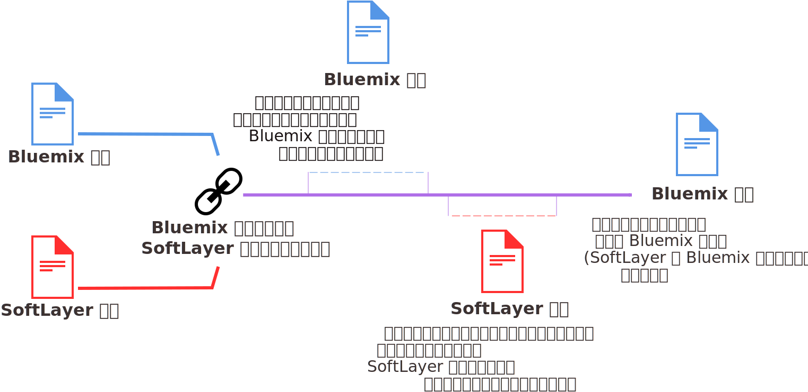

---

copyright:

  years: 2015, 2017
lastupdated: "2017-11-09"

---

{:shortdesc: .shortdesc}
{:codeblock: .codeblock}
{:screen: .screen}
{:new_window: target="_blank"}

# Bluemix アカウントと SoftLayer アカウントのリンク
{: #unifyingaccounts}

{{site.data.keyword.Bluemix_notm}} アカウントと SoftLayer アカウントをリンクして、組み合わせたリソースを使用できます。{{site.data.keyword.Bluemix_notm}} アカウントと Softlayer アカウントをリンクすると、単一の {{site.data.keyword.Bluemix_notm}} 請求書を受け取ることになります。既存の {{site.data.keyword.Bluemix_notm}} アカウントがある場合、SoftLayer リソースについての {{site.data.keyword.Bluemix_notm}} を介した請求は、アカウントのリンク後に開始する新しい請求処理サイクルから有効になります。

**重要:** {{site.data.keyword.Bluemix_notm}} でリンクされるアカウントはすべて、従量課金 (PAYG) アカウントでなければなりません。新規の従量課金 (PAYG) アカウントを作成するか、既存の従量課金 (PAYG) アカウントをリンクするか、あるいは既存のトライアル・アカウント (後で従量課金 (PAYG) アカウントにアップグレード) をリンクできます。{{site.data.keyword.Bluemix_notm}} サブスクリプション・アカウントをリンクすることはできません。

アカウントをリンクするには、SoftLayer アカウントのマスター・ユーザーでなければなりません。

アカウントがリンクされると、以下のようになります。

* SoftLayer と {{site.data.keyword.Bluemix_notm}} アカウントの両方にアクセスするために、IBM ID 資格情報を使用する必要があります。
* 既存の SoftLayer 割引は、{{site.data.keyword.Bluemix_notm}} の料金全体に適用されます。
* 米国ドル (USD) 単位の 1 つの請求書を受け取ります。
* {{site.data.keyword.Bluemix_notm}} コンソールで {{site.data.keyword.BluSoftlayer}} リソースの使用量をモニターできます。

**注意:** アカウントをリンクした後は、リンク解除することはできません。  

マスター・ユーザーは、{{site.data.keyword.Bluemix_notm}} アカウントと SoftLayer アカウントをリンクするために、以下の手順を実行します。

 1. カスタマー・ポータルで**「{{site.data.keyword.Bluemix_notm}} アカウントをリンクします」**をクリックします。
 2. SoftLayer アカウントと {{site.data.keyword.Bluemix_notm}} アカウントをリンクする場合のご利用条件を読み、同意します。
 3. 要求されたら、{{site.data.keyword.Bluemix_notm}} アカウントに関連付けられている E メール・アドレスを指定します。{{site.data.keyword.Bluemix_notm}} アカウントがない場合は、使用する E メール・アドレスを指定し、{{site.data.keyword.Bluemix_notm}} への招待を受けてアカウントを作成するための手順に従います。

アカウントをリンクすると、SoftLayer コンソールのメニュー・バーで**「{{site.data.keyword.Bluemix_notm}} に進む」**が選択可能になります。このリンクをクリックすると、{{site.data.keyword.Bluemix_notm}} ログイン・ページに移動します。

## アカウントがリンクされている場合の {{site.data.keyword.Bluemix_notm}} 使用量に対する請求処理
{: #bill_usage}

{{site.data.keyword.Bluemix_notm}} と SoftLayer の請求アカウントをリンクすると、次の請求処理サイクルは、単一の {{site.data.keyword.Bluemix_notm}} 請求で課金されます。
{:shortdesc}

{{site.data.keyword.Bluemix_notm}} の使用量サイクルは暦月ベースであるため、アカウントは毎月、課金契約に設定された請求日に請求されます。SoftLayer では、使用量サイクルは、SoftLayer の使用を開始したときから始まるため、毎月、SoftLayer アカウントを登録したときと同じ日に請求されます。 

アカウントをリンクした場合、現行月のサイクルの間、{{site.data.keyword.Bluemix_notm}} の使用量が引き続き計測され、その使用量については {{site.data.keyword.Bluemix_notm}} の請求書で請求されます。翌月の初めから、{{site.data.keyword.Bluemix_notm}} と SoftLayer の課金が、{{site.data.keyword.Bluemix_notm}} 請求書で結合されるようになります。

例えば、2017年 4 月 16 日にアカウントをリンクした場合、4 月の使用量については {{site.data.keyword.Bluemix_notm}} の請求書を受け取ります。アカウントをリンクしたタイミングによっては、SoftLayer 使用量に対して別個の請求書を受け取ることがあります。SoftLayer と {{site.data.keyword.Bluemix_notm}} の両方の 5 月の使用量は、{{site.data.keyword.Bluemix_notm}} アカウントを介して請求されます。

請求書がリンクされた後には、{{site.data.keyword.Bluemix_notm}} 請求書には、使用した各リソースに対する別個の料金がリストされます。

## API ベースの Bluemix サービス
{: #api_based_bluemix_services}

以下のリストに含まれているサービスは、アプリケーション・コードを使用して実行するようにセットアップできます。
{:shortdesc}

これらのサービスのすべてのプランが、{{site.data.keyword.Bluemix_notm}} と SoftLayer のリンクされたアカウントで使用できるわけではありません。リンクされたアカウントで使用できるのは、従量課金 (PAYG) アカウント用に有効になっているプランのみです。ただし、個別に請求される個別の {{site.data.keyword.Bluemix_notm}} アカウントがある場合には、これらのすべてのサービスのすべてのプランを使用できます。

* {{site.data.keyword.alchemyapishort}}
* {{site.data.keyword.alertnotificationshort}}
* {{site.data.keyword.sparks}}
* {{site.data.keyword.appseccloudshort}}
* {{site.data.keyword.blockchain}}
* {{site.data.keyword.cloudant}}
* {{site.data.keyword.conceptinsightsshort}}
* {{site.data.keyword.iotmapinsights_short}}
* {{site.data.keyword.dashdbshort}}
* {{site.data.keyword.dialogshort}}
* {{site.data.keyword.documentconversionshort}}
* {{site.data.keyword.twittershort}}
* {{site.data.keyword.weather_short}}
* {{site.data.keyword.iotdriverinsights_short}}
* {{site.data.keyword.geospatialshort_Geospatial}}
* {{site.data.keyword.graphshort}}
* {{site.data.keyword.iotelectronics}}
* {{site.data.keyword.languagetranslationshort}}
* {{site.data.keyword.messagehub}}
* {{site.data.keyword.mqa}}
* {{site.data.keyword.mobileappbuilder_short}}
* {{site.data.keyword.mql}}
* {{site.data.keyword.nlclassifiershort}}
* {{site.data.keyword.objectstorageshort}}
* {{site.data.keyword.personalityinsightsshort}}
* {{site.data.keyword.presenceinsightsshort}}
* {{site.data.keyword.relationshipextractionshort}}
* {{site.data.keyword.retrieveandrankshort}}
* {{site.data.keyword.servicediscoveryshort}}
* {{site.data.keyword.speechtotextshort}}
* {{site.data.keyword.sqldb}}
* {{site.data.keyword.streaminganalyticsshort}}
* {{site.data.keyword.texttospeechshort}}
* {{site.data.keyword.toneanalyzershort}}
* {{site.data.keyword.tradeoffanalyticsshort}}
* {{site.data.keyword.visualinsightsshort}}
* {{site.data.keyword.visualrecognitionshort}}
* {{site.data.keyword.workflow}}
* {{site.data.keyword.workloadscheduler}}
